# How to make Sage's ice wall ability from Valorant
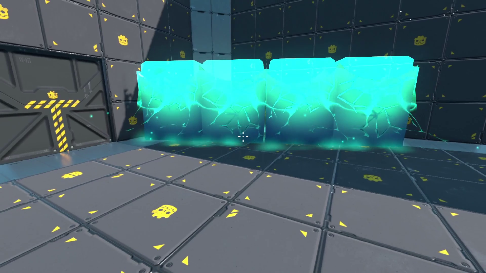

**Disclaimer:** This tutorial assumes you know the basics of using the Godot game engine and have decent understanding of GD Script. However, I'll try my best to explain what each line of code does.

## Contents
- [Overview](#overview)
- [Ice Power](#ice-power)
- [Ice Wall](#ice-wall)
- [Shaders](#shaders)
    - [Indicator](#indicator)
    - [Inner Block](#inner-block)
    - [Outer Block](#outer-block)
- [Particles](#particles)
    - [Fog](#fog)
    - [Sparkles](#sparkles)
    - [Debris](#debris)

## Overview
To make the ability we'll be making two scenes: [one](#ice-power) to be added to the player scene to activate and use the ability, and [one](#ice-wall) being the ice wall that will be instanced/spawned in the scene. Once the logic is done, we'll create the shaders for the effect to make it look polished and pretty. Finally, we'll add some particle systems and animate all the parts.

## Ice Power
This scene will contain a raycast which will detect the surface to spawn the ice wall at. Additionally, this will also, have a mesh instance child to indicate where the ice wall will be spawned. Create a new scene with a spatial node set as the root. Rename it to `IcePower`. Then add a `RayCast`, a `Spatial` and a `MeshInstance` (as a child of the `Spatial`) in the following order:

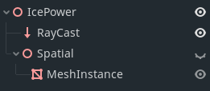

Rename the `RayCast` to `IceRay`, and `Spatial` to `Indicator` if you want. Highly recommended as its a good practice to name your nodes to specify the function of the node in the scene. We'll add a temporary box mesh to the mesh instance with the size set to (8, 2, 2) and move it up to sit on the scene origin.

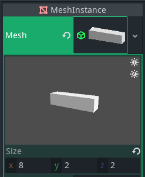

Then, hide the `Indicator` node and select the `IceRay`. In the inspector, enable the raycast and set its `Cast To` property to (0, 0, -20). Save the scene as `IcePower.tscn`. We'll be keeping all the code and assets for the ice ability in a folder called `Ice Power` to help keep the project files organized. Now, to add the logic, attach a script to the scene root. Name the script `icepower.gd` and add the following code to the script:
```GDScript
onready ice_ray = $IceRay
onready var indicator = $Indicator

func _process(_delta):
    if ice_ray.is_colliding():
        indicator.global_transform.origin = ice_ray.get_collision_point()
        indicator.show()
        return
    indicator.hide()
```
The code above references the `IceRay` & `Indicator`, checks if the `IceRay` is colliding with a surface, and positions the indicator to the point of collision of the ray. Additionally, it sets the indicator to only show when the ray is colliding, and otherwise hides it. Instance the scene in the `Head` node in the player controller scene and run the game. We'll see that the ray shows the indicator on all surfaces, but in the original, the indicator only shows in flat floors facing up. Let's update the code to fix that:
```GDScript
func _process(_delta):
    if ice_ray.is_colliding():
        var collision_normal = ice_ray.get_collision_normal()
        if collision_normal.dot(Vector3.UP) > 0.5:
            indicator.global_transform.origin = ice_ray.get_collision_point()
            indicator.global_transform.basis = owner.global_transform.basis
            indicator.show()
        return
    indicator.hide()
```
The code above uses the collision normal returned by the raycast and calculates its dot product with `Vector3.UP`. Whenever the value of the dot product will be greater than 0.5, the indicator would be shown. This is done to make sure not only the floors but even the slopes can be detected. You can replate the condition ` > 0.5 ` with ` == 1 ` if you only want to detect flat floors strictly facing up. Another thing we've done is set the `global_transform.basis` of the indicator to that of the `owner`. The transform.basis is used to set the orientation or rotation of the object, and the owner here would be the node where we instance the scene. So, the code will set the rotation of the indicator to that of the player. When moving the mouse around there is a noticeable jitter in the indicator. To fix that, we'll replace the code setting the `global_transform.origin` of the indicator to instead only set the `translation.z` to the distance of the raycast collision from the player.
```GDScript
if collision_normal.dot(Vector3.UP) > 0.5:
    var offset_dist = ice_ray.get_collision_point().distance_to(global_transform.origin)
    indicator.translation.z = -offset_dist
    indicator.global_transform.basis = owner.global_transform.basis
    indicator.show()
```
The offset distance is calculated by finding the distance from the raycast collision point and the `global_transform.origin` of the `IcePower` node. Then we set the negative of offset_dist to the indicator's z translation. With the indicator moving around smoothly, let's add the logic to activate and deactivate the ability. Starting with adding an action to the input map. Name the action "ice_activate" and set the key to `C` like the original game.

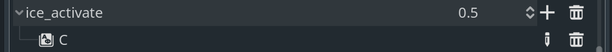

In the script, add a var `active` and set it to `false`. In the process function, check if the action "ice_activate" has just been pressed, and set active to `true`. In an elif block, check if the "ui_cancel" action has just been pressed and set active to `false`. Update the ice_ray condition check to only work when the ability is active.
```GDScript
var active = false

func _process(_delta):
    if Input.is_action_just_pressed("ice_activate"):
        if not active:
            active = true
        else:
            angle = wrapi(angle+90, 0, 360)
    elif Input.is_action_just_pressed("ui_cancel"):
        active = false
    ...
    if active and ice_ray.is_colliding():
        ...
```
To make it so we can change the angle the wall will spawn at, update the code to the following:
```GDScript
var active = false
var angle = 0

func _process(_delta):
    if Input.is_action_just_pressed("ice_activate"):
        if not active:
            active = true
        else:
            angle = stepify(wrapi(angle + 90, 0, 360), 90)
    elif Input.is_action_just_pressed("ui_cancel"):
        active = false
        angle = 0
    ...
            indicator.global_transform.basis = owner.global_transform.basis.rotated(Vector3.UP, deg2rad(angle))
            indicator.show()
```
In the code, we define a var `angle` and add 90 to it every time the "ice_activate" action is pressed and the ability is already active. The `wrapi` function is used to wrap the value to a range of 0 to 360 degrees, and the `stepify` function is used to make sure the angle is always in the multiples of 90. Then we update the line setting the basis of the indicator to use the angle converted to radians and rotated along the UP axis. Now to add a more precise control over the rotation of the indicator, the original game allows pressing the RMB to rotate the indicator freely. Let's add the input actions for the LMB and RMB.

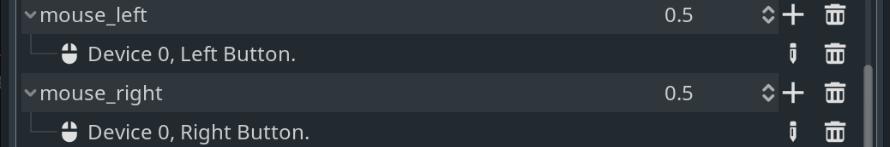

```GDScript
func _input(event):
    
	if active and event is InputEventMouseMotion and Input.is_action_pressed("mouse_right"):
		angle = wrapi(angle + event.relative.x, 0, 360)
```
In the `_input` function, check if the ability is active, the input event is `InputEventMouseMotion` and the "mouse_right" action is currently pressed, and then add the `event.relative.x` to the angle. One issue that arises is that the player's camera also rotated when the mouse is rotated. To make sure the player stays still when rotating the indicator, in the `player.gd` script, lets define a var `looking` set to true and change the player's `look_rot` only when `looking` is true.
```GDScript
var looking = true
...
func _input(event):
	if looking and event is InputEventMouseMotion:
        ...
```

Back in the `icepower.gd` script, define two signals at the top:
```GDScript
signal rotation_started
signal rotation_ended
```
Then, update the `_input` function to emit signal calls when the "mouse_right" action has just been pressed and just been released:
```GDScript
func _input(event):
	if Input.is_action_just_pressed("mouse_right"):
		emit_signal("rotation_started")
	elif Input.is_action_just_released("mouse_right"):
		emit_signal("rotation_ended")
    ...
```
Lastly, connect the signals in the player scene to the player script and set the value of `looking` accordingly:
```GDScript
func _on_ice_rotation_started():
	looking = false


func _on_ice_rotation_ended():
	looking = true
```
With that, the player camera would not rotate when rotating the indicator.

## Ice Wall
Create a new scene with a `Spatial` node as the root, and rename it to `IceBlock` or `IceWall` (whichever suits you). To the scene root, add a `KinematicBody`, and to that, add a `CollisionShape` and `MeshInstance` both set to the indicator's size. The `KinematicBody` will later me animated but for now let's save the scene as `IceBlock.tscn` and update the code in `IcePower.gd` to add the ice block.
```GDScript
onready var block_scene = load("res://Ice Tutorial/Ice Power/Block.tscn")
...
func _process(_delta):
    ...
    if ice_ray.is_colliding() and active:
		var collision_normal = ice_ray.get_collision_normal()
		
		if collision_normal.dot(Vector3.UP) > 0.5:
			...
			indicator.show()
			
			if Input.is_action_just_pressed("mouse_left"):
				create_block()
			return
```
Right after setting the indicator to show, the code checks is the LMB has just been pressed and calls a `create_block()` function. Lets define the function down below:
```GDScript
func create_block():
	var new_block = block_scene.instance()
	get_tree().current_scene.add_child(new_block)
	new_block.global_transform.origin = indicator.global_transform.origin
	new_block.global_transform.basis = indicator.global_transform.basis
	active = false
	angle = 0
```
The function creates an instance of the block_scene and adds it to the current game scene. Then, it sets the `global_transform.origin` (global location) and `global_transform.basis` (global rotation) to that of the indicator. Finally, it sets active to false and the angle to 0.

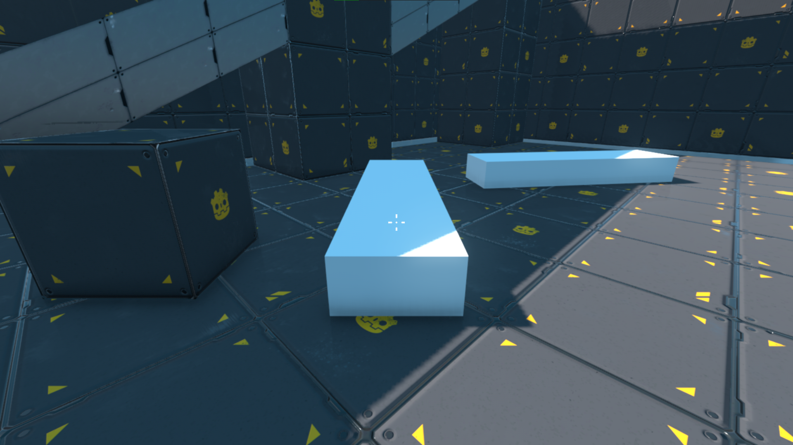

Running the game now would give you a feature complete ability of creating walls using the C key and LMB, but this is not even half the work. Let's make the whole game mechanic look as good as the original.

## Shaders
As far as I noticed from playing the original game, the effect consists of a total of 6 parts: 3 shaders & 3 particle systems. Additionally, the indicator contains also has a shader applied along with a particle system. Although some basic understanding of the shaders can be helpful in the following sections, I'll be explaining most of the shader tricks to make it easy to understand if you've never worked with shaders before.

### Indicator
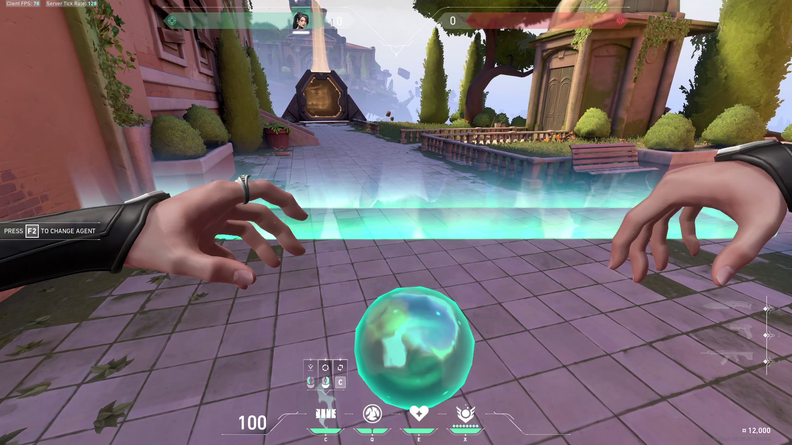
The indicator in the original game is basically a rectangular halo-like light that glows brighter when the ability is activated or rotated along with a small burst of particles. To make this effect, I've prepared a cuboid shape in Blender with the top and bottom faces deleted as we won't be needing them. Do note the mesh consists of several faces and UV mapped to the same coordinates, all covering the entire texture space.

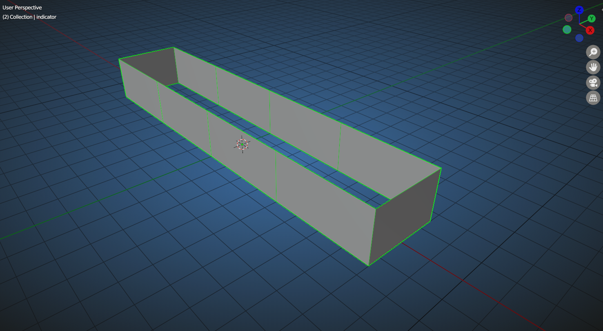

One of the important parts of creating VFX like this is understanding where and how the mesh would have to be created to get the desired result. However, in the current case the mesh required is quite simple to understand. Now, export the mesh as a gltf and import it in the Godot project. We only need the `MeshInstance`, so copy it and replace the previous `MeshInstance` in the IcePower scene with the new one. Create a new `ShaderMaterial` for the mesh in the inspector and in that, create a new shader.

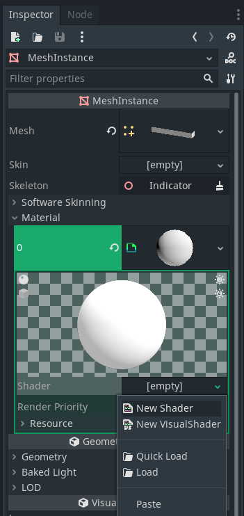

Click on the shader to open the shader editor near the bottom of the screen, and add the following shader code.
```GLSL
shader_type spatial;
render_mode blend_add,cull_disabled;

uniform vec4 color: hint_color;

void fragment() {
    ALBEDO = color.rgb;
    EMISSION = color.rgb;
}
```
The first line defines the type of shader we're writing, here `spatial`. A spatial shader is generally used for 3D models. In the next line the render mode is set to a few flags. The `blend_add` flag makes it so the fragments (or pixels) of the model are added to the pixels of whatever is being drawn behind the object. This is useful for creating transparent and/or glowing objects. Next, the cull_disabled flag is set to ensure the parts of the mesh facing away from the camera are also rendered. By default the quads of the mesh facing away from the camera are not rendered to save resources. Next, we define a uniform of the type vec4 and give it the name "color". Setting a variable as uniform makes it accessable outside the shader, giving us the ability to change it from GD Script code or animating through and `AnimationPlayer`. Also, the vec4 is given a `hint_color` tag to let the editor know that we intend to use it as a color value. Because of this if you look at the inspector, under the shader params, the variable will be shown as a color which we can easily set. Let's set it to <span style="color:#00ffee">#00ffee</span> for now.

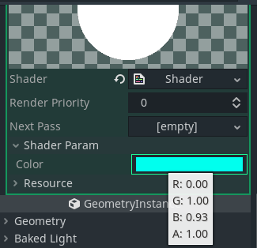

In the shader, we defined a `fragment()` function, which is run on every pixel of the model that's rendered to screen. Inside the function, we set the `ALBEDO` (or the color) of the fragment as well as the `EMISSION` to `color.rgb`. Now we'll use a trick known as proximity fade. Proximity fade makes the object transparent wherever it intersects with other objects, using the depth buffer. The depth buffer or the depth texture contains the distance of the fragment from the camera, and is useful for a number of effects. For our case, we'll use it to calculate the distance of the fragment from the surface behind it and make it transparent if its too close.
```GLSL
uniform float proximity_fade_dist: hint_range(0.0, 1.0, 0.01) = 0.25;

void fragment() {
    float alpha = 1.0;

    // proximity fade
    float depth_tex = texture(DEPTH_TEXTURE, SCREEN_UV).r;
	vec4 world_pos = INV_PROJECTION_MATRIX * vec4(SCREEN_UV * 2.0 - 1.0, depth_tex * 2.0 - 1.0, 1.0);
	world_pos.xyz /= world_pos.w;
	alpha *= 1.0 - smoothstep(world_pos.z + proximity_fade_dist, world_pos.z, VERTEX.z);

    ALBEDO = color.rgb;
    COLOR = color.rgb;
    ALPHA = clamp(alpha, 0.0, 1.0);
}
```
The code above samples the `DEPTH_TEXTURE` provided by the renderer and extracts the r value from it (since its just a greyscale image). Then we calculate the world position of the fragment by cross multiplication of `INV_PROJECTION_MATRIX` with a vec4 using the `SCREEN_UV` as the x & y value, and depth_tex as the z value. Note that both the values are converted from (0 to 1) range to (-1 to 1) range. In the next line, we divide the x, y & z values of world_pos with the w value. Lastly, we use the smoothstep function to calculate a smooth value between the z world position + proximity_fade_dist and z world position. The uniform for `proximity_fade_dist` has been defined on the top and is set to the hint_range of 0 to 1 with the default value of 0.25. Make sure to set the `ALPHA` to the value of the variable `alpha` clamped between 0 & 1. Running the game, the indicator would be fading at the intersections just like the original game. The UV map is a 2D vector that goes from 0 to 1 along the X & Y axis, the X going horizontally and Y going vertically. We can get the value of the fragment using the value of UV. So, let's use the y value of the UV along with a couple of smoothstep functions to create the aura/glow of the effect.
```GLSL
uniform float fade_length: hint_range(0.0, 1.0, 0.01) = 0.5;
...
void fragment() {
    float alpha = 1.0;

	// fade
	float short_fade = smoothstep(1.0 - fade_length, 1.0, UV.y);
	float long_fade = smoothstep(0.7 - fade_length, 1.5, UV.y);
	alpha *= (long_fade + short_fade) * fade_length;
    ...
}
```
In the code, we define a new uniform float, name it `fade_length` with a range of 0 to 1. Inside the fragment function, we calculate two floats: one for a short fade and one for a longer fade.
Note: The **smoothstep** function calculates a smooth value using a minimum, a maximum and an x value like so: `smoothstep(min, max, x)`.
Through experimentation I found the values above work well to create a shorter stronger fade and a longer more subtle fade. After that, we add the two fade values and multiply them with fade_length to make it so the whole effect fades out when the length reaches 0.

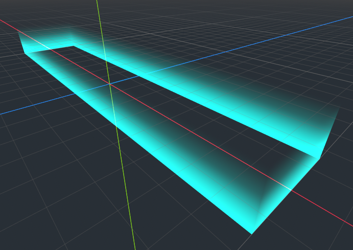

To make the effect look interesting, we'll use some pattern textures to change the color, alpha and normal of the fragments. I created these textures for the effect:


The first will be used to create some wavy trails and the second will be used as normal map to create some icy cracks.
The way of importing and using texture involves creating a uniform sampler2D, and sampling it's color for the fragment using the `texture` or `textureLod` functions. Example:
```GLSL
shader_type spatial;

uniform sampler2D my_texture;

void fragment() {
    vec3 color = texture(my_texture, UV).rgb;

    ALBEDO = color;
}
```
In the fragment function, we call the `texture` function, passing the texture and the UV coordinate to get the color at, and extract the r, g & b values from it. This value is stored in a vec3 variable named color, which is then passed to the `ALBEDO` value of the material. We can distort the texture by multiplying of adding values to the vec2 UV. One common usage is to add `vec2(TIME)` to the UV to make the texture scroll over time like in a waterfall or fire. Using this information let's update our shader to use the pattern textures.

```GLSL
uniform float fade_length: hint_range(0.0, 1.0, 0.01) = 0.5;
uniform sampler2D pattern1_texture;
uniform sampler2D pattern2_texture;
...
void fragment() {
	float pattern1 = texture(pattern1_texture, UV * vec2(1.0, 0.1) + vec2(TIME * 0.01, TIME * 0.1)).r;
	vec3 pattern2 = texture(pattern2_texture, UV * vec2(1.0, 0.5) + vec2(TIME * -0.01, 0.5)).rgb * 0.5;
	float alpha = 1.0;
    ...
    // pattern
	alpha += (pattern1 * short_fade * 0.2);
    alpha += (pattern2.g * (short_fade + long_fade));
    ...
```
We define two `uniform sampler2D`'s, set their textures in the inspector and sample them in the fragment function. Since pattern 1 is greyscale, we can only extract the r component. Also, we multiply the UV with vec2 so stretch or squeeze the texture depending on the need, as well as add offset vec2's to scroll them over time. Note, to control the speed of scroll, we multiply a value with TIME. After that, we add the value of pattern1 multiplied by short_fade so that it only shows along the length of the shorter fade and not beyond. Similarly, we multiply pattern2.g to the sum of the two fade variables and add it to the alpha. The effect will start looking much more interesting, but we still don't have the icy look. Add the following code to set the normal of the fragment, set the roughness to a low amount and we should be almost done with the indicator effect.
```GLSL
    ...
    ALPHA = clamp(alpha, 0.0, 1.0);
	NORMALMAP = pattern2;
	ROUGHNESS = 0.1;
```
For the final touch, we'll replace the color uniform with two: color1(<span style="color:#00ffee">#00ffee</span>) & color2(<span style="color:#00ffaa">#00ffaa</span>), and show a gradient between the two based on the fade length using the `mix` function. Here's the complete shader in its final form:
```GLSL
shader_type spatial;
render_mode blend_add, cull_disabled;

uniform vec4 color1: hint_color;
uniform vec4 color2: hint_color;
uniform float fade_length: hint_range(0.0, 1.0, 0.01) = 0.5;
uniform sampler2D pattern1_texture;
uniform sampler2D pattern2_texture;
uniform float proximity_fade_dist = 0.25;

void fragment() {
	float pattern1 = texture(pattern1_texture, UV * vec2(1.0, 0.1) + vec2(TIME * 0.01, TIME * 0.1)).r;
	vec3 pattern2 = texture(pattern2_texture, UV * vec2(1.0, 0.5) + vec2(TIME * -0.01, 0.5)).rgb * 0.5;
	float alpha = 1.0;

	// fade
	float short_fade = smoothstep(1.0 - fade_length, 1.0, UV.y);
	float long_fade = smoothstep(0.7 - fade_length, 1.5, UV.y);
	alpha *= (long_fade + short_fade) * fade_length;

	// pattern
	alpha += (pattern1 * short_fade * 0.2);
    alpha += (pattern2.g * (short_fade + long_fade));

	// proximity fade
	float depth_tex = texture(DEPTH_TEXTURE, SCREEN_UV).r;
	vec4 world_pos = INV_PROJECTION_MATRIX * vec4(SCREEN_UV * 2.0 - 1.0, depth_tex * 2.0 - 1.0, 1.0);
	world_pos.xyz /= world_pos.w;
	alpha *= 1.0 - smoothstep(world_pos.z + proximity_fade_dist, world_pos.z, VERTEX.z);

	// color
	vec3 color = mix(color1.rgb, color2.rgb, clamp(short_fade, 0.0, 1.0));

	ALBEDO = color;
	EMISSION = color;
	ALPHA = clamp(alpha, 0.0, 1.0);
	NORMALMAP = pattern2;
	ROUGHNESS = 0.1;
}
```

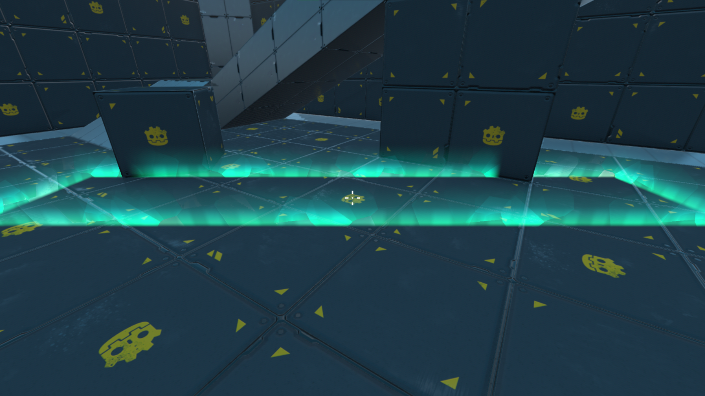

### Inner Block
The original effect has a temporary inner ice block shown when the outer (final) iceblock is forming. I made a simple beveled cuboid in Blender with the bottom faces deleted and the UV map set like so:


Export the mesh as a gltf making sure no material is assigned to the object, and import it in Godot. In the ice wall scene replace the old box mesh with this one and update the collision shape to fit the new mesh.

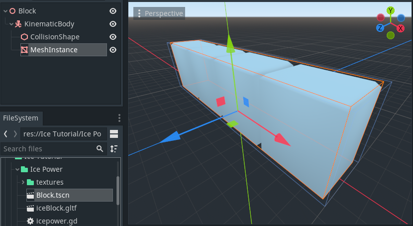

Create a shader material and assign a new shader to it. Then add the following shader code:
```GLSL
shader_type spatial;
render_mode blend_add, unshaded, cull_disabled;

uniform float intensity: hint_range(0.0, 1.0, 0.01) = 1.0;
uniform float cutoff: hint_range(1.0, 10.0, 0.01);
uniform vec4 color: hint_color;
uniform float proximity_fade_dist = 2.0;
uniform sampler2D pattern_texture;

void fragment() {
	float alpha = 1.0 - UV.y * cutoff;
	
	// pattern
	float pattern = texture(pattern_texture, UV - vec2(sin(TIME * 0.2) * 0.5, TIME * 0.5)).r;
	alpha += pattern;
	
	// proximity fade
	float depth_tex = texture(DEPTH_TEXTURE, SCREEN_UV).r;
	vec4 world_pos = INV_PROJECTION_MATRIX * vec4(SCREEN_UV * 2.0 - 1.0, depth_tex * 2.0 - 1.0, 1.0);
	world_pos.xyz /= world_pos.w;
	alpha *= 1.0 - smoothstep(world_pos.z + proximity_fade_dist, world_pos.z, VERTEX.z);
	
	ALPHA = clamp(alpha, 0.0, 1.0) * intensity;
	ALBEDO = color.rgb;
}
```
Since we won't be needing the shadows, roughness and normal in the shader, we'll set the render_mode to unshaded. In the fragment function, we use the UV.y to set the value of alpha. We subtract UV.y from 1 to invert the value, making the fade start from top to bottom instead of bottom to top. Also, the uniform cutoff is multiplied to change the length of the fade. Then we import the following texture, scroll it over time and add it to the alpha.


After that, we calculate the proximity fade and multiply it to the alpha. Finally, we set the value of `ALPHA` to alpha multiplied by a uniform intensity, as well as the value of `ALBEDO` to that of the uniform color.

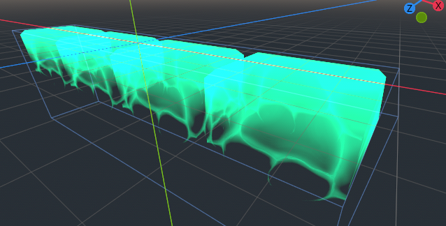

### Outer Block
The final block of ice that we see in the original dissolves in from bottom to top in a unique pattern. I prepared this ice block in Blender and painted the diffuse, roughness, normal & emission map.

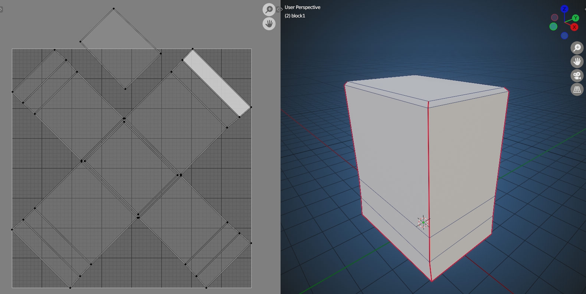


Back in Godot import the model and create a new shader material for it.
```GLSL
shader_type spatial;
render_mode blend_mix, cull_disabled;

uniform sampler2D albedo_texture;
uniform sampler2D roughness_texture;
uniform sampler2D normal_map;
uniform sampler2D emission_map;

void fragment() {
	vec3 color = texture(albedo_texture, UV).rgb;
	float rough = texture(roughness_texture, UV).r;
	vec3 normal = texture(normal_map, UV).rgb;
	
	// emission
	vec3 emit = texture(emission_map, UV).rgb;

	ALBEDO = color;
	ROUGHNESS = rough;
	NORMALMAP = normal;
	EMISSION = emit;
}
```
The above code simply has the uniforms for the textures, samples them in the fragment function and sets the corresponding values giving us the following result:

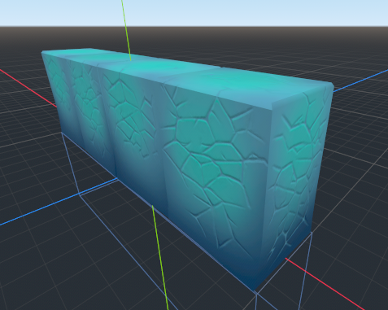

Now, to dissolve the block, we'll use another texture to define the direction to dissolve in.


The way it would work is, that for each fragment, the shader will compare the value from the dissolve texture to a given threshold and if the value is not greater than or equal to the thresshold, it will not display the fragment. To make the task easier, Godot has a function called `step` which takes the dissolve value and the threshold value and returns 0 or 1 depending on the condition.
```GLSL
uniform float dissolve_threshold: hint_range(0.0, 1.0, 0.01);
uniform sampler2D dissolve_texture;
uniform sampler2D albedo_texture;
...

void fragment() {
	...
    // dissolve
	float dissolve = texture(dissolve_texture, UV).r;
	float alpha = step(dissolve, dissolve_threshold);
	...
	ALPHA = alpha;
	ALPHA_SCISSOR = 0.1;
	ALBEDO = color;
    ...
}
```
In the code above, we use a sampler2D `dissolve_texture` and a float `dissolve_threshold` in the step function, and set the result as the alpha. The rendering order would be wonky, so to make it display correctly, we'll set the `ALPHA_SCISSOR` to a small value. Lastly, we'll define a uniform float to control the strength of the emission and multiply it to the emission. Here's the final shader code:
```GLSL
shader_type spatial;
render_mode blend_mix, cull_disabled;

uniform float dissolve_threshold: hint_range(0.0, 1.0, 0.01);
uniform sampler2D dissolve_texture;
uniform sampler2D albedo_texture;
uniform sampler2D roughness_texture;
uniform sampler2D normal_map;
uniform sampler2D emission_map;
uniform float emission_strength: hint_range(0.0, 1.0, 0.01);

void fragment() {
	vec3 color = texture(albedo_texture, UV).rgb;
	float rough = texture(roughness_texture, UV).r;
	vec3 normal = texture(normal_map, UV).rgb;
	
	// emission
	vec3 emit = texture(emission_map, UV).rgb;
	
	// dissolve
	float dissolve = texture(dissolve_texture, UV).r;
	float alpha = step(dissolve, dissolve_threshold);
	
	ALPHA = alpha;
	ALPHA_SCISSOR = 0.1;
	ALBEDO = color;
	ROUGHNESS = rough;
	SPECULAR = 0.0;
	NORMALMAP = normal;
	EMISSION = emit * emission_strength;
}
```

### Outer Wave
The last shader we need to create is the icy wave that gathers towards the ice block and fades away as the ice block dissolves in.
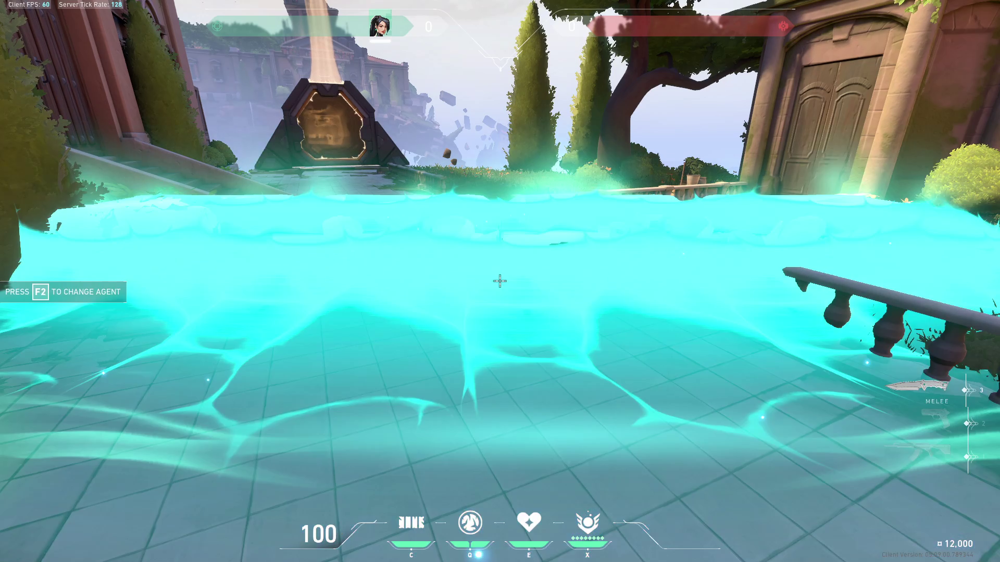

We'll start with duplicating the indicator mesh in Blender and modifying the mesh to look a bit like an inverted funnel.
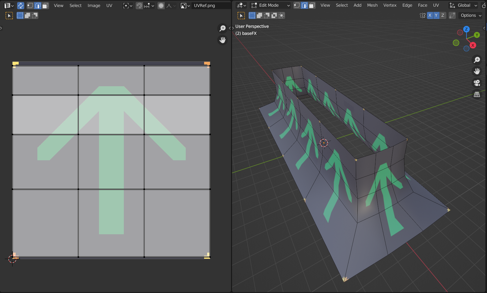
Export as gltf, import in Godot, rinse, repeat and we can start deciphering the shader for the effect.
From my observation, the shader would comprise of 4 parts:
- The cutoff to display the beginning of the wave,
- The edge that forms around this beginning,
- A pattern that trails behind this edge &
- A subtle glow, also trailing behind the edge.
Similar to the block dissolve, we'll use a texture to dissolve the wave. Actually, we'll use this texture for almost every part of this shader.


In the shader, we'll use the texture as the input for the step function to dissolve the mesh.
```GLSL
shader_type spatial;
render_mode blend_add,unshaded,cull_disabled;

uniform float offset: hint_range(0.0, 1.0, 0.001) = 0.0;
uniform sampler2D fade_texture;

uniform float proximity_fade_distance = 0.5;

void fragment() {
    float fade = texture(fade_texture, UV).r;

	// effects
	float fx_cutoff = 1.0 - step(offset, fade);

    float alpha = fx_cutoff;

    // proximity fade
    float depth_tex = texture(DEPTH_TEXTURE, SCREEN_UV).r;
    vec4 world_pos = INV_PROJECTION_MATRIX * vec4(SCREEN_UV*2.0-1.0, depth_tex*2.0-1.0, 1.0);
    world_pos.xyz /= world_pos.w;
    alpha *= 1.0 - smoothstep(world_pos.z + proximity_fade_distance, world_pos.z, VERTEX.z);

    ALPHA = alpha;
```
In the code above, we have a uniform float called `offset` defined to control the effect. The value of this uniform is used in the step function to calculate a cutoff, which we'll set as the alpha for now. With this shader above, we can dissolve the wave using a slider in the inspector. Note: we've included the code for proximity fade as well to prevent any harsh clipping with the floors and walls of the map.

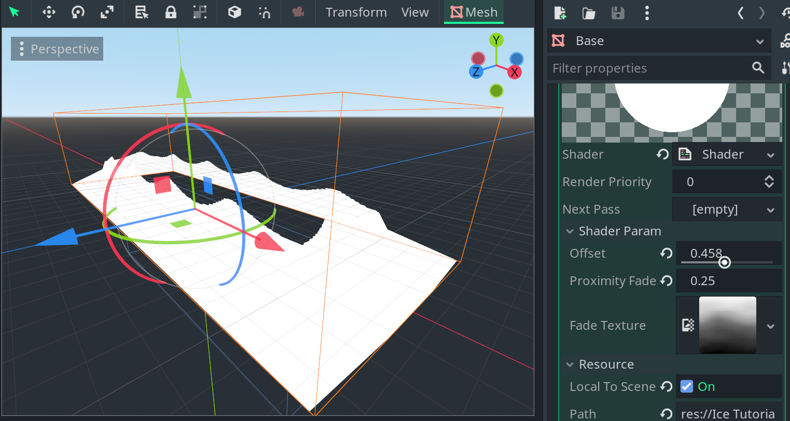

Let's fade the bottom of the wave. Define a new float `fx_fade` and use the smoothstep function to create a smooth transition to black.
```GLSL
	...
	// effects
	float fx_cutoff = 1.0 - step(offset, fade);
	float fx_fade = smoothstep(offset, 1.0 + offset, fade);
    float alpha = fx_fade;
	...
```
Multiplying the value of `fx_fade` with `fx_cutoff` will give us a nice wave, but there's no option to control the length of the fade. Let's define a uniform and subtract it from the offset in the smoothstep function.
```GLSL
uniform float offset: hint_range(0.0, 1.0, 0.001) = 0.0;
uniform float fade_length: hint_range(0.0, 1.0, 0.01);
uniform sampler2D fade_texture;
...
	// effects
	float fx_cutoff = 1.0 - step(offset, fade);
	float fx_fade = smoothstep(offset - fade_length, 1.0 + offset - fade_length, fade);
    float alpha = fx_cutoff * fx_fade;
	...
```
Using this we should have a wave with control of the position and the length of the fade.
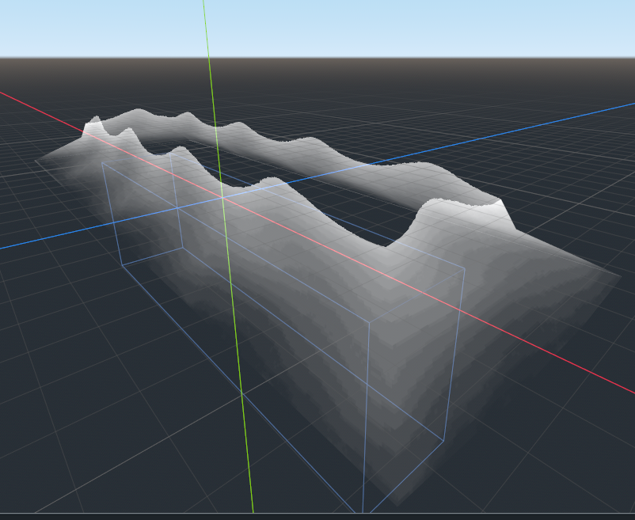

To make the edge more prominent, let's define another float `fx_edge` to add a more visible edge to the effect.
```GLSL
...
uniform float fade_length: hint_range(0.0, 1.0, 0.01);
uniform float edge: hint_range(0.0, 0.5, 0.001);
uniform sampler2D fade_texture;
    ...
    float fx_edge = smoothstep(offset - edge, offset, fade);
    float alpha = fx_cutoff * (fx_fade + fx_edge);
```
The edge also uses a smoothestep function, with the beginning and the end set to the offset with the start a little lower, set using the edge uniform. Lastly, we add the value of `fx_edge` to `fx_fade` before multiflying it to cutoff. Set the shader parameters in the inspector and we should start seeing the edge along the... well, edge.

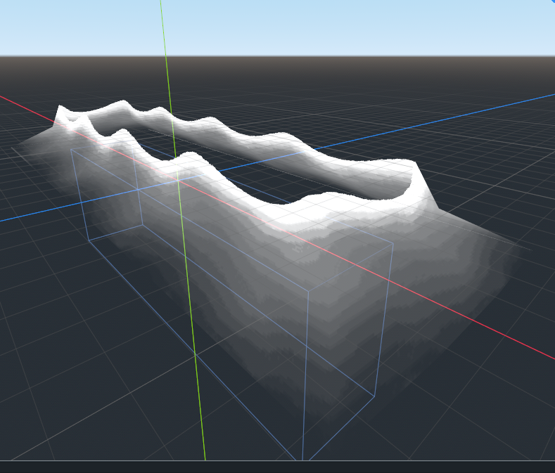

Finally, to make the effect look interesting, we'll once again, take the help of our pattern texture and define our last float `fx_pattern`.


```GLSL
...
uniform sampler2D fade_texture;
uniform sampler2D pattern_texture;
    ...
    float pattern = texture(pattern_texture, UV).r;
    ...
    float fx_pattern = smoothstep(offset, offset + 0.5, fx_fade + fade + pattern);
    float alpha = fx_pattern;
    float alpha = fx_cutoff * ( fx_fade + fx_edge + fx_pattern );
```
We've added the value of `fade` and `fx_fade` to the pattern to make the effect (kind of) blend with the edge. Add it to the sum of the values and we should have a good looking effect.

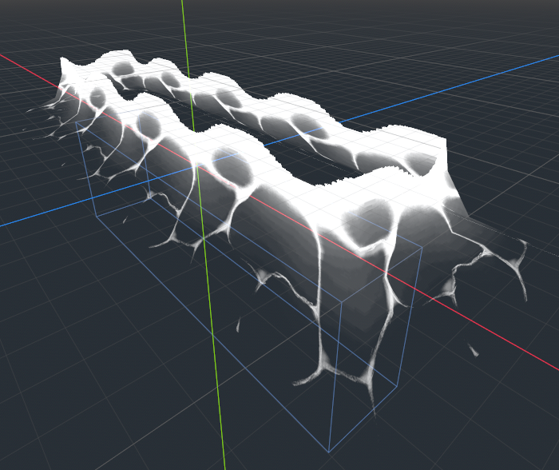

Let's add color to the effect. Define two uniform vec4's with the hint_color tags, and mix them based on the value of the pattern and the edge.
```GLSL
uniform vec4 color_1: hint_color; // #00ffee
uniform vec4 color_2: hint_color; // #00ffaa
uniform sampler2D fade_texture;
uniform sampler2D pattern_texture;
    ...
    float alpha = fx_cutoff * ( fx_fade + fx_edge + fx_pattern );
    vec3 color = mix(color_1.rgb, color_2.rgb, clamp(fx_pattern + fx_edge, 0.0, 1.0));
    ...
    ALBEDO = color;
```

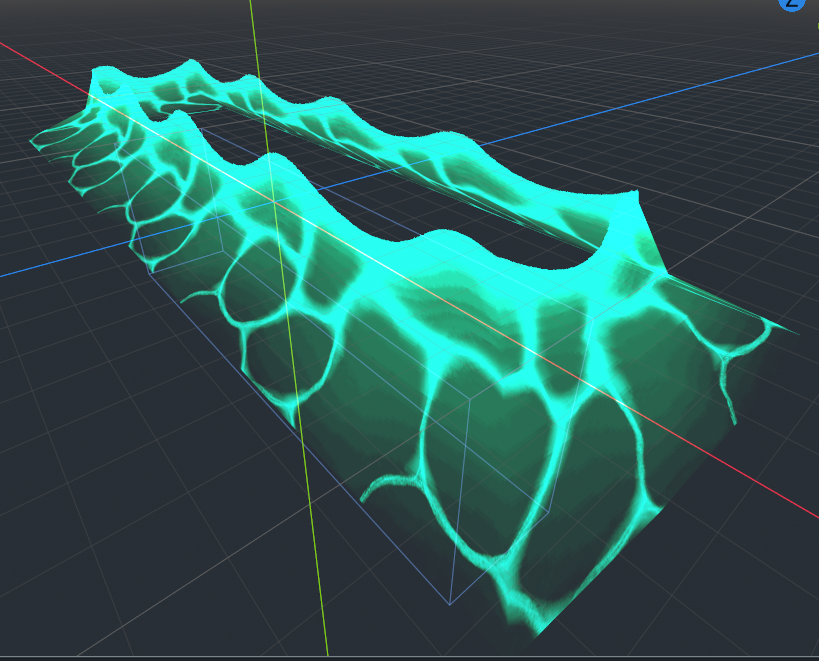

Finally to bring life to the effect, let's displace the UV's of the textures using the value of `TIME` resulting in an animated effect. Here's the complete shader:
```GLSL
shader_type spatial;
render_mode blend_add, unshaded, cull_disabled;

uniform float intensity: hint_range(0.0, 1.0, 0.01);
uniform float offset: hint_range(0.0, 1.0, 0.001) = 0.0;
uniform float fade_length: hint_range(0.0, 1.0, 0.01);
uniform float edge: hint_range(0.0, 0.5, 0.01) = 0.2;
uniform vec4 color_1: hint_color;
uniform vec4 color_2: hint_color;
uniform sampler2D fade_texture;
uniform sampler2D pattern_texture;
uniform float proximity_fade_dist = 0.5;

void fragment() {
	// textures
	float fade = texture(fade_texture, UV + vec2(TIME * 0.7, 0.0)).r;
	float pattern = texture(pattern_texture, UV + vec2(TIME * -0.2, TIME * -0.5)).r;
	
	// effects
	float fx_cutoff = 1.0 - step(offset, fade);
	float fx_fade = smoothstep(0.0 + offset - fade_length, 1.0 + offset - fade_length, fade);
	float fx_edge = smoothstep(offset - edge, offset, fade);
	float fx_pattern = smoothstep(offset, offset + 0.5, fade + pattern + fx_fade);
	
	float alpha = (fx_fade + fx_edge + fx_pattern) * fx_cutoff;
	
	// color
	vec3 color = mix(color_1.rgb, color_2.rgb, clamp(fx_edge + fx_pattern, 0.0, 1.0));
	
	// proximity fade
	float depth_tex = texture(DEPTH_TEXTURE, SCREEN_UV).r;
	vec4 world_pos = INV_PROJECTION_MATRIX * vec4(SCREEN_UV * 2.0 - 1.0, depth_tex * 2.0 - 1.0, 1.0);
	world_pos.xyz /= world_pos.w;
	alpha *= 1.0 - smoothstep(world_pos.z + proximity_fade_dist, world_pos.z, VERTEX.z);
	
	ALPHA = clamp(alpha, 0.0, 1.0) * intensity;
	ALBEDO = color;
}
```

## Particles
To add the finishing touches to the effect, we need chiefly three particle effects: the fog that appears in the beginning, the sparkles that show throughout the animation, and the debris that shows at the end.
### Fog
The fog particle system is added to the scene root of the block scene. It uses a simple texture applied to quads.


The settings for the process material are as follows:
- amount: 128
- oneshot: true
- explosive: 0.95
- randomness: 0.65
- emission shape: box: (7, 0.2, 3)
- direction: (0, 1, 0)
	- spread: 30
- gravity: (0, -1, 0)
- radial accel: 3 + random
- damping: 1 + random
- scale: 0.25
- color ramp: set to fade to transparent over time
- draw pass: new Quad
	- material
		- flags: transparent, unshaded
		- vertex color: use as albedo
		- blend mode: add
		- billboard mode: particle
		- albedo color: #00ffaa
		- albedo texture: load texture
		- proximity fade: enabled
### Sparkles
The sparkles particle system would use a slightly different texture with quads as well.


The settings are as follows:
- amount: 48
- explosive: 0.5
- randomness: 0.4
- emission shape: box: (10, 1, 5)
- direction: (0, 1, 0)
	- spread: 30
- gravity: (0, 0, 0)
- initial velocity: 2 + random
- damping: 1 + random
- scale curve: decrease scale over time
- color ramp: set to fade to transparent over time
- draw pass: new Quad
	- material
		- flags: transparent, unshaded
		- vertex color: use as albedo
		- blend mode: add
		- billboard mode: particle
		- albedo color: #00ffaa
		- albedo texture: load texture

### Debris
The last part would the debris, or ice shards, or something. I made a basic mesh in Blender and UV mapped it to use the same textures as the ice block.

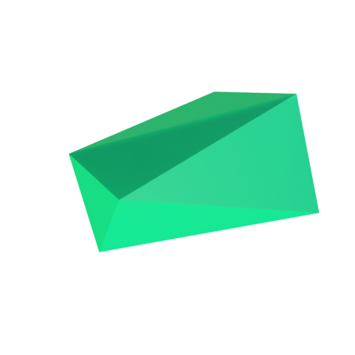

The settings are as follows:
- amount: 16
- lifetime: 0.5
- oneshot: true
- explosive: 0.8
- randomness: 0.8
- emission shape: box: (8, 1, 2)
- direction: (0, 1, 0)
	- spread: 30
- gravity: (0, -2, 0)
- initial velocity: 2
- angular velocity: 100 + random
	- velocity curve: slows down over time
- damping: 0.5 + random
- angle: 360 + random
- scale: 0.05 + random
- scale curve: decrease scale over time
- draw pass: shard mesh
	- material: use ice block textures

## Animation
With that, we should have all the pieces of the effect ready to be used in-game. Add an `AnimationPlayer` node to the block scene and set its process mode to "physics" and speed to 2. Then, define a new animation with the length of 2 seconds and set it to autoload. Add keyframes for the different shader parameters and fade them out at the end using the intensity parameters. Don't forget to animate the emitting property of the particle systems to make them emit at the correct times, and after some tuning and tweaks to the various values and keyframes, you should have a gorgeous looking effect that animates whenever you create a wall in-game.

## Conclusion
The effect still looks far from the professional look of the original game. You can always add/modify the effect to make it better. For example, I copied the particle systems to the indicator and emit them whenever the activity is enabled or the indicator is rotated. You can always make additions to this project if you want, just make a fork and create a PR. I hope this helps you create awesome VFX for your own game! Oh and remember the most important part of learning: don't be afraid to experiment and play around with the values! Cheers!